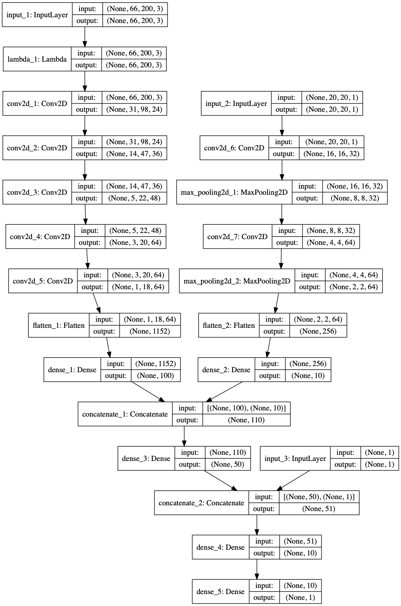
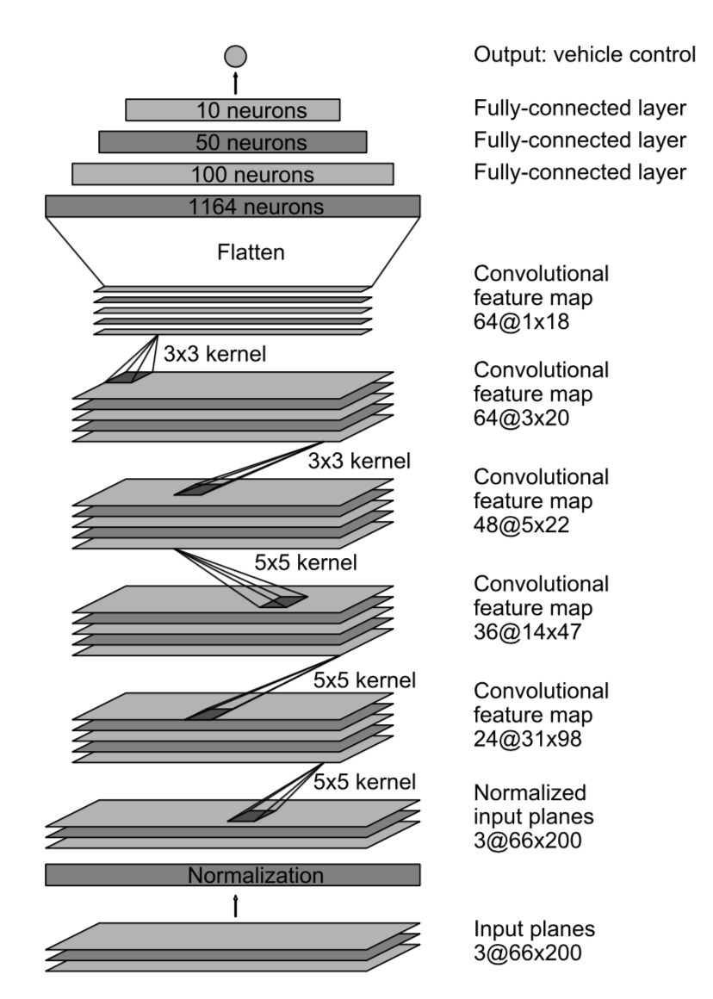
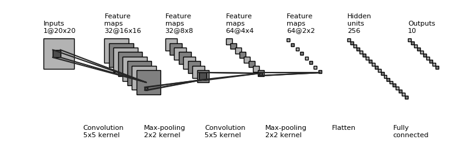

# DeepGTA5

## 使用
`python drive.py`

## 神经网络架构
#### 总架构

#### 主模型

#### 路径模型

## 使用的工具
控制GTA5中的汽车运行：使用[Xbox插件](https://github.com/shauleiz/vXboxInterface)控制车辆速度，以及转弯角度。

绘制卷积神经网络图像：[draw_convnet](https://github.com/gwding/draw_convnet)，keras的plot_model函数

## 历程
1.在deepgta5/collect_data/getkeys/screen.py中，采集屏幕时之所以不使用python自带的pillow库（PIL），是因为用pillow采集速度很慢，如果希望每1s采集一个较大的区域，采集下来的图片会有大量没有采集到的地方，也就形成的大块的黑色区域。使用win32API速度会快很多，足以1s采较大的图像，所以选择了使用win32API。

2.参考了NVIDIA论文的[End to End Learning for Self-Driving Cars](https://arxiv.org/abs/1604.07316)，以及论文[Driving in the Matrix: Can Virtual Worlds Replace Human-Generated Annotations for Real World Tasks?](https://arxiv.org/abs/1610.01983)。前者提供了一个可行的卷积神经网络架构，后者说明了在GTA5中训练的self-drving model可以迁移到现实世界中。

3.最初使用Inception V4，在Tesla K80 GPU训练了5天，然而loss并没有明显下降，故更换到目前的模型。目前使用的模型比Inception浅得多，训练和运行速度也大大提升。

